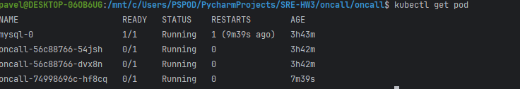
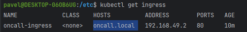
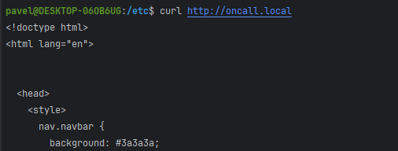

# Предварительные требования

```shell
git clone https://github.com/linkedin/oncall.git
```
```shell
cd oncall
```
```shell
eval $(minikube docker-env)
```
```shell
docker build -t oncall:latest
```
Создаём Secret с паролем к БД и Headless Service:
# MySQL
cd mysql
```shell
kubectl apply -f secret.yaml
```

```shell
kubectl apply -f service.yaml
```

Запускаем нагрузку MySQL
```shell
kubectl apply -f statefulset.yaml
```


Проверяем, запущен ли под:
```shell
kubectl get pod
```


#  2. Запуск OnCall
```shell
kubectl apply -f config.yaml

```

```shell
kubectl apply -f service.yaml
```

```shell
kubectl apply -f deployment.yaml
```

Проверяем, запущены ли поды
```shell
kubectl get pod
```

```shell
kubectl get ingress
```

```shell
curl http://oncall.local
```
